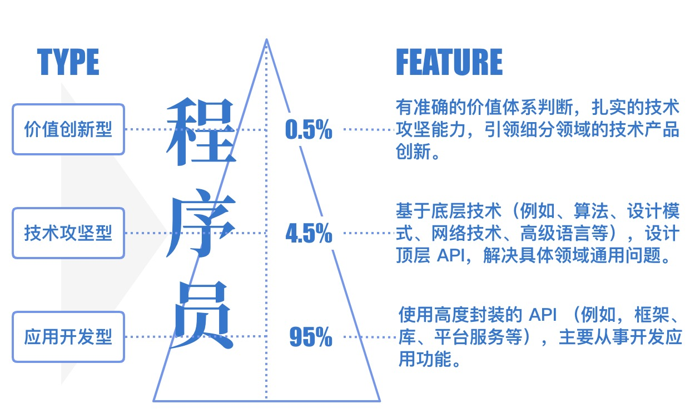
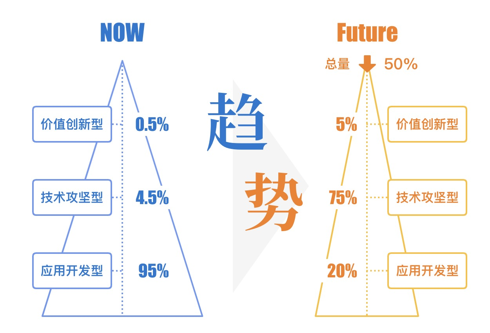
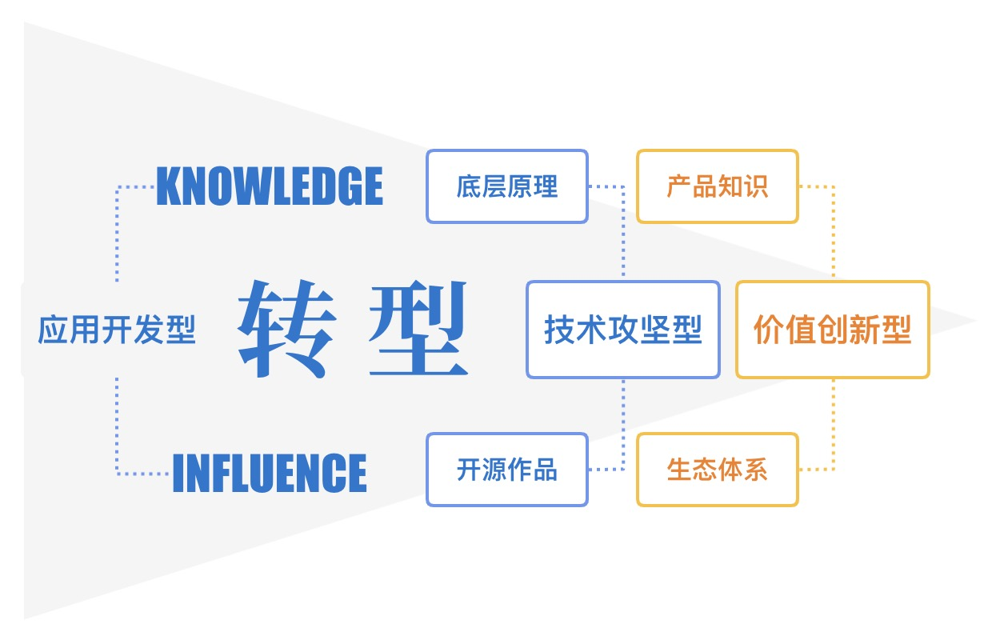

# 程序员的生存与发展 2022

> 作者本人现任某互联网大厂前端高级技术专家。

## 背景

> 2022 年 3 月，教育部新闻发布会通报，2022届高校毕业生规模首次突破1000万人，预计1076万人。
>
> 据东方财富 Choice 统计，截止 2022年  4 月 30 日 A 股共有 4650 家企业公布了员工变动人数，其中有 1697 家企业进行了不同程度的裁员，裁员总数为 909993 人。

互联网产业从 20 年之前的萌芽初期到如今的蓬勃发展，**时代赋予互联网的红利逐渐消失了**。而时代进程中，一个不可或缺的角色，**程序员**，又将何去何从？

## 定位职业属性

### 应用开发型程序员

典型特征是使用高度封装API（例如，框架、库、平台服务等），主要从事开发应用功能。

数量上，是程序员中绝大多数的从业者。在互联网高速发展时期，业务爆发式增长带来超高的业务利润率，使得**研发速度**带来的收益远大于**研发质量**的需要。市场人才供不应求，导致技术门槛要求较低，也促使大量的短期培训人员、非专业转型人员进入程序员的行业。

在职业发展上，尽管很多研发工作出自该群体的劳动，但该群体容易将个人能力的评估过高，忽略互联网红利的影响。同时，该群体具有较强的可替代性。

### 技术攻坚型程序员

典型特征基于底层技术（例如、算法、设计模式、网络技术、高级语言等），设计顶层 API，解决具体领域通用问题。

数量上，是从业者中较少的一部分专业群体。在互联网业务爆发时期，该群体主要集中在巨头公司的核心技术部门，以及无法快速通过开源框架解决的业务团队中。

在职业发展上，该群体具备较强的核心竞争力， 一般有较多的核心技术作品或开源作品，对行业发展往往有一定的借鉴性。

### 价值创新型程序员

典型特征是有准确的价值体系判断，扎实的技术攻坚能力，引领细分领域的技术产品创新。

数量上，是技术攻坚型程序员中的佼佼者。互联网的发展，同时也带动了**开源领域**和**技术服务领域**的高速发展，这使得程序员的优秀作品能够快速的成为行业通用解决方案，在**企业级框架**、**工程自动化**、**AI 智能化**等诸多细分领域，都带来了与时俱进的发展。

在职业发展上，该群体是行业技术发展的领导者、先驱者、布道者。往往具备较强的综合能力和大局观，尤其是对技术产品、技术价值的深入理解。

> 那么，你属于哪一种类型呢？

## 分析未来趋势

**计算机算力**、**工具自动化**、**人工智能**等代表生产力的核心领域飞速发展，以及**开源生态**的日益繁荣，大幅度改变了程序员的开发模式。应用开发型程序员，不仅生产力翻倍，而且大量工作被自动化与智能化取代，未来模式中将仅有小部分应用型程序员负责复杂的业务维护。

中国网民突破10亿后，**增量**见顶，**获客成本**也随之提高。业务发展模式必将从暴力扩张，转变为趋于稳定的发展。产品质量和技术壁垒的优势将越发明显。因此，业务缩减和自动化高速发展的双重因素，不仅对程序员需求量锐减，还会使整体程序员总量下降。此时，技术攻坚型程序将成为企业发展的中坚力量，其中价值创新型程序员依然是高端行业生产力发展的核心。

> 你是否具备核心竞争力，从而避免被优化吗？

## 应对持续变化

如果是恰巧是一名不具备核心竞争力的应用开发型程序员，那么你需要
